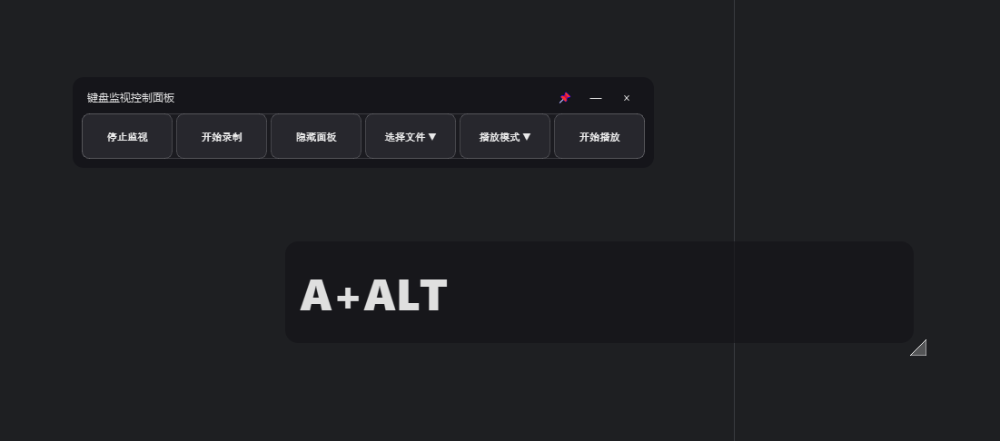

# Key Overlay (Windows)



<p align="left">
  <a href="https://www.python.org/" target="_blank"></a>
  <a href="https://doc.qt.io/qtforpython-6/" target="_blank"></a>
  
  
  
  
  
  
</p>

一个用于 Windows 的键盘按键显示与录制/回放的小工具，基于 PySide6。包含“显示面板”（透明 HUD）与“控制面板”（简约游戏风/微信风标题栏），支持置顶、拖拽、调整大小、录制保存与选择播放、重复播放、循环播放等功能。

## 功能特性
- 按键显示：透明背景 + 半透明灰黑色长条背景，大号字体展示当前按下的组合（如 `A+S`）。
- 显示面板：可隐藏/显示、可拖拽、可在右下角拖拽调整大小、可选择屏幕四角位置。
- 控制面板：双排布局、简约设计、自定义标题栏、支持"📌置顶"同时置顶控制面板和显示面板。
- 录制：开始/停止录制，停止时可选择保存到默认路径或自定义路径（默认路径：`%USERPROFILE%\.key_overlay\last_record.json`）。
- 回放：播放前3秒倒计时、支持播放N次/循环播放/停止播放，统一的播放控制界面。
- 托盘菜单：显示/隐藏显示面板、位置（四角）、开始/停止录制、播放选项、退出。

## 环境要求
- Windows 10 或更高版本
- Python 3.10+

## 安装
```powershell
cd key-overlay
pip install -r requirements.txt
```

部分系统下，`keyboard` 库需要以管理员权限运行终端后再启动程序，才能正常监视/回放全局键盘事件。

## 运行
```powershell
python app.py
```

启动后会看到两个窗口：
- 控制面板：单排紧凑布局，左侧为"开始/停止监视""开始/停止录制""显示/隐藏显示面板"，右侧为播放控制"选择文件""播放模式""开始/停止播放"，标题栏右侧有"📌置顶 / — 最小化 / × 关闭"。
- 显示面板：半透明长条 HUD，用于展示当前按键组合。可拖拽移动，右下角可拉伸调整大小。

## 使用说明
- 监视：点击“开始监视”以开启全局键盘监视；停止监视会清空显示。
- 录制：点击“开始录制”开始记录；点击“停止录制”时会弹出保存选择：
  - 保存到默认路径：`%USERPROFILE%\.key_overlay\last_record.json`
  - 选择保存位置：保存到你指定的 `.json` 文件
  - 取消：默认仍会保存到默认路径，避免误丢失
- 播放：采用选择-配置-执行的流程设计
  - "选择文件 ▼"：选择"最近录制"或"选择文件..."来指定播放源
  - "播放模式 ▼"：选择"播放一次"、"播放N次"或"循环播放"
  - "开始播放"：执行播放（会显示3秒倒计时，可按ESC取消），播放中变为"停止播放"
- 置顶：点击标题栏“📌”可将控制面板与显示面板同时保持最前。
- 托盘：右下角托盘图标提供相同的控制项与位置切换（四角）。

### 托盘新增
- “播放最近×5”：快速重复播放 5 次
- “循环播放最近”：持续循环回放
- “停止播放”：结束当前回放

### 注意
- 循环/重复回放会向系统持续发送按键事件，请谨慎使用。

## 常见问题
- 没有显示或无法监视/回放：尝试以管理员身份运行终端后再启动程序。
- 回放会向系统发送按键事件，请在安全环境中测试，避免影响到重要窗口或输入框。

## 目录结构（简要）
```
key-overlay/
  app.py               # 主程序
  requirements.txt     # 依赖
  README.md            # 说明文档
  p1.png               # 示例截图
```

## 更新记录

### 0.1.1
- 新增：支持播放 N 次与循环播放，以及停止播放
- 新增：播放前3秒倒计时功能，屏幕中央显示，可ESC取消
- 优化：播放控制采用选择-配置-执行的三步流程设计
- 优化：控制面板改为单排紧凑布局，按钮完美对齐
- 优化：文件选择与播放模式分离，操作逻辑更清晰
- 托盘菜单新增快捷项：播放最近×5、循环播放最近、停止播放

### 0.1.0
- 初始版本

## 贡献
欢迎 Issue 和 PR！
- 提交前请尽量复现、标注系统/环境与复现步骤。
- UI/交互改进、性能优化、Bug 修复与国际化都非常欢迎。

## License
MIT（可按需修改）。

## 鸣谢
- [PySide6 文档](https://doc.qt.io/qtforpython-6/)
- [keyboard 库](https://pypi.org/project/keyboard/)

